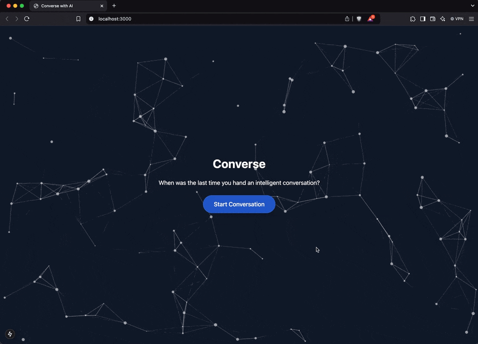

# Conversational AI Agent (Front-end Client)

A Next.js-based front-end application for conversational AI agents, built with Agora's Real-Time Communication SDK.



## Prerequisites

Before you begin, ensure you have the following installed:

- [Node.js](https://nodejs.org/) (version 16.x or higher)
- [pnpm](https://pnpm.io/) (version 8.x or higher)

You must have an Agora account and a project to use this application.

- [Agora Account](https://console.agora.io/)

## Installation

1. Clone the repository:

```bash
git clone https://github.com/AgoraIO-Community/conversational-ai-client.git
cd conversational-ai-client
```

2. Install dependencies:

```bash
pnpm install
```

3. Create a `.env.local` file in the root directory and add your environment variables:

```bash
cp .env.local.example .env.local
```

4. Run the development server:

```bash
pnpm dev
```

4. Open your browser and navigate to `http://localhost:3000` to see the application in action.

## Contributing

Contributions are welcome! Please feel free to submit a Pull Request.

## License

This project is licensed under the MIT License - see the LICENSE file for details.
