# Custom Conversational AI Agent

This folder contains the infrastructure as code for deploying a custom conversational agent. The infrastructure deploys a scalable system on AWS that includes agent instances, a proxy router, and a Redis database, managed using Pulumi.

## Prerequisites

- [Pulumi CLI](https://www.pulumi.com/docs/get-started/install/)
- [Node.js](https://nodejs.org/) (v14 or later)
- [AWS Account](https://aws.amazon.com/)
- [Docker](https://www.docker.com/get-started) (for local development)
- [Agora](https://console.agora.io/en/)
- [ElevenLabs](https://elevenlabs.io/app/sign-in)

## Configuration

1. Set up your Pulumi stack:

```bash
pulumi stack init dev
```

2. Configure the required secrets:

```bash
pulumi config set --secret aws:accessKey <YOUR_AWS_ACCESS_KEY>
pulumi config set --secret aws:secretKey <YOUR_AWS_SECRET_KEY>
pulumi config set --secret aws:region <YOUR_AWS_REGION>
pulumi config set --secret agoraAppId <YOUR_AGORA_APP_ID>
pulumi config set --secret agoraAppCert <YOUR_AGORA_APP_CERT>
pulumi config set --secret elevenLabsApiKey <YOUR_ELEVENLABS_API_KEY>
pulumi config set --secret elevenLabsAgentID <YOUR_ELEVENLABS_AGENT_ID>
pulumi config set --secret elevenLabsVoiceID <YOUR_ELEVENLABS_VOICE_ID>
pulumi config set elevenLabsModel <YOUR_ELEVENLABS_MODEL>
pulumi config set systemInstruction "Your custom system prompt here..."
```

> Note: We recommend creating a new IAM user and using [policy.json](./policy.json) to grant only necessary permissions.

3. Deploy using Pulumi:

```bash
pulumi preview  # Review changes
pulumi up       # Deploy infrastructure
```

## Deployment

1. Preview the changes:

```bash
pulumi preview
```

2. Deploy the infrastructure:

```bash
pulumi up
```

## Cleanup

To destroy the infrastructure:

```bash
pulumi destroy
```

## Infrastructure Outputs

After deployment, you can access important information using:

```bash
pulumi stack output
```

This will show:

- Redis host and port
- Agent public and private IP addresses
- Proxy Router public and private IP address
- ECR Registry URLs for proxy and agent

## Development

The [infrastructure code](./index.ts) includes:

- Container registry setup (ECR repositories for proxy and agent)
- VPC configuration with public/private subnets
- Agent EC2 instance creation with auto-scaling
- Proxy router configuration and deployment
- Redis cluster setup
- Network security and IAM configuration

## Architecture

```mermaid
graph TD
    %% Client
    Internet((Client))

    %% AWS VPC Container
    subgraph VPC["AWS VPC"]

        %% Public Subnet
        subgraph PublicSubnet["Public Subnet"]
            ProxyRouter["Proxy Router<br/>(t3.micro)"]
        end

        %% Private Subnet
        subgraph PrivateSubnet["Private Subnet"]
            Redis["Redis Cluster<br/>(Stores:<br/>Requests + ClientX-ID)"]
            Agent1["Agent Instance 1<br/>(c5.xlarge)"]
            Agent2["Agent Instance 2<br/>(c5.xlarge)"]
            Agent3["Agent Instance 3<br/>(c5.xlarge)"]
        end

    end

    %% Connections
    Internet --> ProxyRouter
    ProxyRouter --> Redis
    Redis --> ProxyRouter
    ProxyRouter --> Agent1
    ProxyRouter --> Agent2
    ProxyRouter --> Agent3

    %% Styling
    classDef vpc fill:#f5f5f5,stroke:#333,stroke-width:2px
    classDef subnet fill:#e1f5fe,stroke:#333,stroke-width:1px
    classDef gateway fill:#00b002,stroke:#333,stroke-width:1px
    classDef component fill:#000,stroke:#333,stroke-width:1px
    classDef storage fill:#a02,stroke:#333,stroke-width:2px

    class VPC vpc
    class PublicSubnet,PrivateSubnet subnet
    class ProxyRouter gateway
    class Agent1,Agent2,Agent3 component
    class Redis storage
```



- **VPC Infrastructure**

  - Configured across 2 availability zones
  - Public and private subnets (CIDR mask /20)
  - NAT Gateways (one per AZ) for private subnet internet access

- **Container Registry (ECR)**

  - Proxy Router Repository
  - Agent Repository

- **Compute Resources**

  - Agent Instances (3x c5.xlarge)
    - 4 vCPUs, 8GB RAM per instance
    - Deployed in private subnets (distributed across AZs)
    - Running containerized ElevenLabs agents
    - Configured with Agora RTC support
    - Auto-configured with Docker and AWS ECR login
    - Capacity controlled by `maxRequestsPerBackend` config
  - Proxy Router Instance (t3.micro)
    - Deployed in public subnet
    - Handles load balancing and request routing
    - Manages agent connection mapping
    - Auto-configured with Docker and environment setup

- **Redis Cluster**

  - ElastiCache Redis 7.0
  - Single node configuration (cache.t3.micro)
  - Encryption at rest and in transit
  - Authentication enabled with auto-generated credentials
  - Used for session state and routing information
  - Dedicated subnet group for deployment

- **Security Groups**

  - Agent Security Group
    - Allows HTTP (8080)
    - Allows Agora RTC (UDP 1024-65535)
    - Allows internal VPC communication
  - Proxy Security Group
    - Allows HTTP (8080)
    - Full egress access
  - Redis Security Group
    - Allows access only from proxy router (6379)
    - No other inbound access permitted

- **IAM Configuration**
  - EC2 instance profile with:
    - ECR read access
    - Systems Manager access
    - Minimal required permissions model

## Security Notes

- All components run within a dedicated VPC
- Private subnets used for agent instances and Redis
- Redis encryption enabled both at rest and in transit
- Security groups implement principle of least privilege
- IAM roles configured with minimal required permissions
- All sensitive configuration stored as Pulumi secrets
- Authentication required for Redis access
- Proxy router controls access to backend services

## Contributing

We welcome contributions to this project. Please see the [CONTRIBUTING.md](../CONTRIBUTING.md) file for more information.
